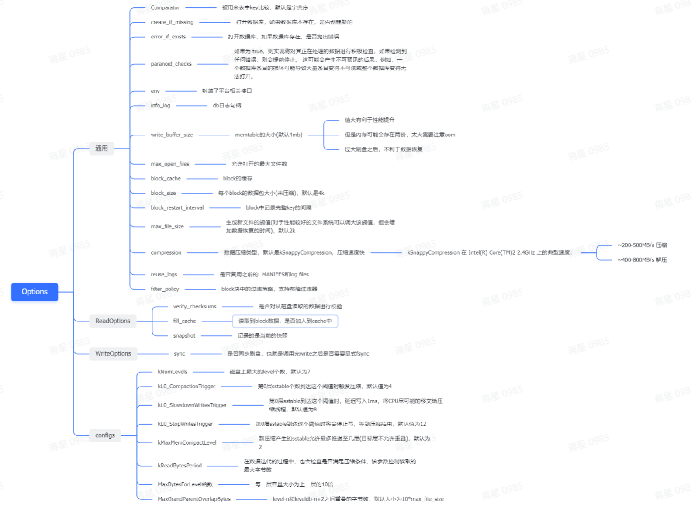

#### leveldb::Options

`leveldb::Options` 是 LevelDB 提供的配置选项类，用于控制数据库的行为和性能。通过这个类，我们可以设置数据库的读写缓存大小、压缩方式、是否开启写入日志等特性。下面是 `leveldb::Options` 类的常见配置选项：

- `create_if_missing`：如果指定的数据库不存在，是否创建一个新的数据库。
- `error_if_exists`：如果指定的数据库已存在，是否返回错误。
- `paranoid_checks`：是否进行严格校验，包括数据校验和、CRC32 校验等。
- `write_buffer_size`：每个 memtable 的写入缓冲区大小。
- `max_open_files`：同时打开的文件句柄数量。
- `block_size`：每个 data block 的大小。
- `block_restart_interval`：每个 block 重启时的 key 数量。
- `compression`：数据的压缩方式，默认是 Snappy 压缩。

除了上述常用选项外，`leveldb::Options` 类还提供了许多其他的配置选项，可以根据具体需求进行设置。在使用 LevelDB 时，我们需要根据存储场景和使用情况来选择适合的配置选项，以达到最佳性能和准确性。

要创建并初始化一个 `leveldb::Options` 对象，可以通过以下方式：

```
c++Copy Codeleveldb::Options options;
options.create_if_missing = true;
options.write_buffer_size = 64 * 1024 * 1024;
options.max_open_files = 1000;
options.block_size = 4096;
options.block_restart_interval = 16;
options.compression = leveldb::kSnappyCompression;
```

 

