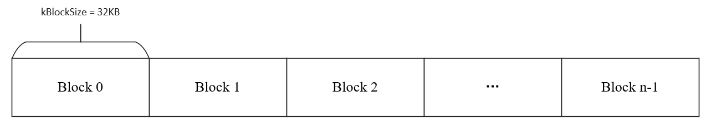
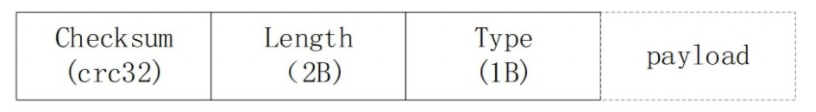
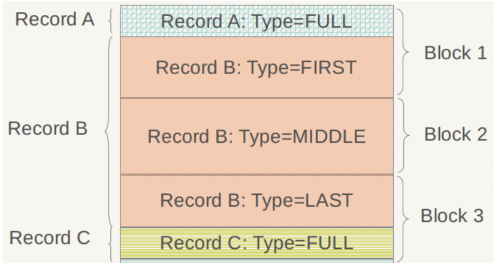
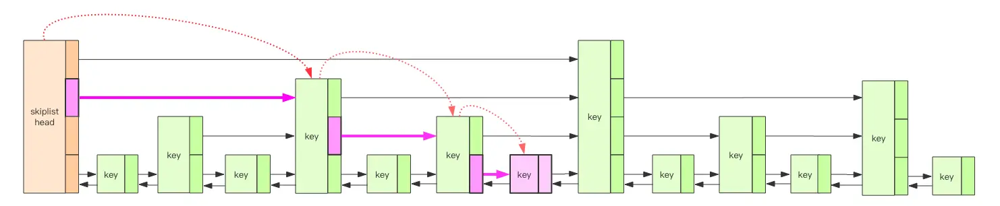

## [levelDB 体系结构](#)

LevelDB是Google开源的持久化KV单机数据库，具有很高的随机写，顺序读/写性能，但是随机读的性能很一般，也就是说，LevelDB很适合应用在查询较少，而写很多的场景，LevelDb是一个持久化存储的KV系统，和Redis这种内存型的KV系统不同，**LevelDb不会像Redis一样狂吃内存，而是将大部分数据存储到磁盘**上。

### 一. 六个主要构成

levelDB主要有六个部分来实现LSM-Tree的功能，LevelDb作为存储系统，数据记录的存储介质包括内存以及磁盘文件中。对于写数据，接口会同时写入**MemTable**（内存）和**log**文件上。当**MemTable**达到**阈值**时，MemTable会**冻结**，**变为** **Immutable MemTable**，并将数据写入**SST**表（磁盘上）中；同时生成新的MemTable及log文件供新的接入。

  从图中可以看出，构成LevelDb静态结构的包括六个主要部分：

- 内存的数据结构：MemTable和Immutable MemTable
- 磁盘4种主要文件：Current文件，Manifest文件，log文件，SSTable文件

当然，LevelDb除了这六个主要部分还有一些辅助的文件，但是以上六个文件和数据结构是LevelDb的主体构成元素。**这六个部分的配合关系如下**，当往系统中插入一条键值对记录时：

（1）LevelDb会先往log文件里写入，Log文件在系统中的作用主要是用于系统崩溃恢复而不丢失数据，一个log文件对应一个Memtable

（2）log文件写入成功后将记录插进Memtable中，Memtable的底层数据结构是一个SkipList

（3）Memtable插入的数据占用内存到了一个界限后，LevleDB会生成新的Log文件和Memtable，原先的Memtable就成为Immutable Memtable，Immutable Memtable只接受读操作，不再接受写操作

（4）LevelDb后台调度会将Immutable Memtable的数据导出到磁盘，形成一个新的SSTable文件

（5）SSTable中的某个文件属于特定层级，而且其存储的记录是key有序的，Manifest文件记载了SSTable各个文件的管理信息，比如属于哪个Level，文件名，最小key和最大key各自是多少，manifest会记载所有SSTable文件的这些信息

（6）Current文件的内容只有一个信息，就是记载当前的manifest文件名。因为在LevleDb的运行过程中，随着**Compaction**的进行，**Manifest**也会跟着反映这种变化，**此时往往会新生成Manifest文件来记载这种变化，而Current则用来指出哪个Manifest文件才是我们关心的那个Manifest文件**。

#### 1.1 Log文件（磁盘）

写Memtable前会先写Log文件，Log通过append的方式顺序写入。Log的存在使得机器宕机导致的内存数据丢失得以恢复。Memtable中的数据没有来得及Dump到磁盘的SSTable文件，LevelDB也可以根据log文件恢复内存的Memtable数据结构内容，不会造成系统丢失数据，在这点上LevelDb和Bigtable是一致的。

**物理布局**：LevelDb对于一个log文件，会把它切割成以32K为单位的物理Block，每次读取的单位以一个Block作为基本读取单位，所以从物理布局来讲，一个log文件就是由连续的32K大小Block构成的，一个Block可能只包含一条记录，也可能包含多条记录。

**逻辑布局**: 在应用的视野里是看不到这些Block的，应用看到的是一系列的Key:Value对，在LevelDb内部，会将一个Key:Value对看做一条记录的数据，另外在这个数据前增加一个记录头，用来记载一些管理信息，以方便内部处理。

记录头包含三个字段：
* **ChechSum**：该字段是对“类型”和“数据”字段的校验码，大小为4字节，为了避免处理不完整或者是被破坏的数据，当LevelDb读取记录数据时候会对数据进行校验，如果发现和存储的CheckSum相同，说明数据完整无破坏，可以继续后续流程
* **Length**：该字段记载了数据的大小，2字节，也就是2^16次方为极限值。
* **Type**：该字段则指出了每条记录的逻辑结构和log文件物理分块结构之间的关系，具体而言，主要有以下四种类型：
  * FULL
  * FIRST
  * MIDDLE
  * LAST。

* **payload**：该字段则是上面讲的Key:Value数值对。

 如果记录类型是FULL，代表了当前记录内容完整地存储在一个物理Block里，没有被不同的物理Block切割开；如果记录被相邻的物理Block切割开，则类型会是其他三种类型中的一种。假设目前存在三条记录，Record A，Record B和Record C，其中Record A大小为10K，Record B 大小为80K，Record C大小为12K，那么其在log文件中的逻辑布局会如下图所示：

* **Record A** 因为大小为10K < 32K，能够放在一个物理Block中，所以其类型为FULL
* **Record B 大小为80K**，而Block 1因为放入了Record A，所以还剩下22K，不足以放下Record B，所以在Block 1的剩余部分放入Record B的开头一部分，类型标识为FIRST，代表了是一个记录的起始部分；Record B还有58K没有存储，这些只能依次放在后续的物理Block里面，因为Block 2大小只有32K，仍然放不下Record B的剩余部分，所以Block 2全部用来放Record B，且标识类型为MIDDLE，意思是这是Record B中间一段数据；Record B剩下的部分可以完全放在Block 3中，类型标识为LAST，代表了这是Record B的末尾数据。
* **Record C因为大小为12K**，Block 3剩下的空间足以全部放下它，所以其类型标识为FULL。

#### 1.2 Memtable（内存）和 Immutable Memtable（内存）

LevelDB 的内存中维护了 2 个跳跃列表，一个是只读的 Memtable，一个是可修改的 Immutable Memtable，为内存数据结构，**跳表**实现。新的数据会首先写入Memtable。

达到Memtable设置的容量上限后，Memtable会变为Immutable为之后向SST文件的归并做准备。Immutable Mumtable不再接受用户写入，同时生成新的Memtable、log文件供新数据写入。

当Memtable写入的数据占用内存到达指定数量，则自动转换为Immutable Memtable，等待Dump到磁盘中，系统会自动生成新的Memtable供写操作写入新数据，理解了Memtable，那么Immutable Memtable自然不在话下。

SkipList是平衡树的一种替代数据结构，但是和红黑树不相同的是，SkipList对于树的平衡的实现是基于一种随机化的算法的，这样也就是说SkipList的插入和删除的工作是比较简单的。关于SkipList的详细介绍可以参考这篇文章，LevelDb的SkipList基本上是一个具体实现，并无特殊之处。SkipList不仅是维护有序数据的一个简单实现，而且相比较平衡树来说，在插入数据的时候可以避免频繁的树节点调整操作，所以写入效率是很高的，LevelDb整体而言是个高写入系统，SkipList在其中应该也起到了很重要的作用。Redis为了加快插入操作，也使用了SkipList来作为内部实现数据结构。

#### 1.3 SSTable文件（磁盘）

磁盘数据存储文件。SSTable(Sorted String Table)就是由内存中的数据不断导出并进行Compaction操作后形成的，而且SSTable的所有文件是一种层级结构，第一层为Level 0，第二层为Level 1，依次类推，层级逐渐增高，这也是为何称之为LevelDb的原因。除此之外，**Compaction(压实)**动作会将多个SSTable合并成少量的几个SSTable，**以剔除无效数据，保证数据访问效率并降低磁盘占用**。

LevelDb不同层级有很多SSTable文件（以后缀.sst为特征），所有.sst文件内部布局都是一样的。Log文件是物理分块的，SSTable也一样会将文件划分为固定大小的物理存储块，但是两者逻辑布局大不相同，根本原因是：Log文件中的记录是Key无序的，即先后记录的key大小没有明确大小关系，而.sst文件内部则是根据记录的Key由小到大排列的，从下面介绍的SSTable布局可以体会到Key有序是为何如此设计.sst文件结构的关键。下图展示了.sst文件的内部逻辑解释。

#### 1.4 Manifest文件（磁盘）

Manifest文件中记录SST文件在不同Level的分布，单个SST文件的最大最小key，以及其他一些LevelDB需要的元信息。

####  1.5 Current文件（磁盘）

从上面的介绍可以看出，LevelDB启动时的首要任务就是找到当前的Manifest，而Manifest可能有多个。Current文件简单的记录了当前Manifest的文件名，从而让这个过程变得非常简单。

### 二、源码目录结构
主要通过源码的目录结构以及阐述关键目录和源文件的职责的方式来展示源码的整个架构。

**cmake**：cmake的相关文件
**db**：主要机制的实现，包括版本管理，compact，业务读写等功能机制实现；
**doc**：文档；
**helpers/memenv**：简单完全内存的文件系统，提供操作目录文件接口；
**include/leveldb**：头文件，外部工程使用leveldb时引用的头文件；
**port**：平台相关的实现，主要提供posix/android相关支持；
**table**：定义了整个leveldb的持久化存储的数据结构
**util**：通用功能实现。

参考文档：

* https://blog.csdn.net/MOU_IT/article/details/117152605
* https://www.cnblogs.com/haippy/archive/2011/12/04/2276064.html