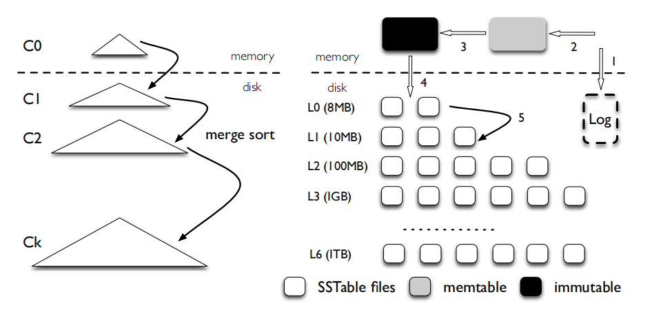
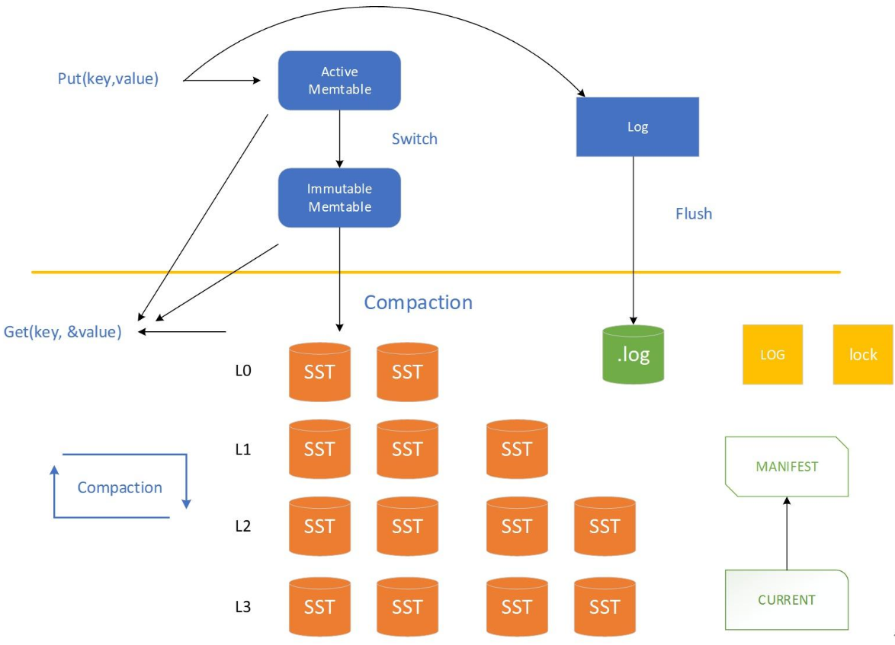

## [levelDB 体系结构](#)

LevelDb作为存储系统，数据记录的存储介质包括内存以及磁盘文件中。对于写数据，接口会同时写入**MemTable**（内存）和**log**文件上。当**MemTable**达到**阈值**时，MemTable会**冻结**，**变为** **Immutable MemTable**，并将数据写入**SST**表（磁盘上）中；同时生成新的MemTable及log文件供新的接入。

#### 一. 六个主要构成

下面详细介绍六个主要构成：

* **Log文件（磁盘）**

作用：写Memtable前会先写Log文件，Log通过append的方式顺序写入。Log的存在使得机器宕机导致的内存数据丢失得以恢复。

* **Memtable（内存）**

作用：内存数据结构，**跳表**实现。新的数据会首先写入这里。

* **Immutable Memtable（内存）**

作用：达到Memtable设置的容量上限后，Memtable会变为Immutable为之后向SST文件的归并做准备。Immutable Mumtable不再接受用户写入，同时生成新的Memtable、log文件供新数据写入。

* **SST文件（磁盘）**

作用：磁盘数据存储文件。SSTable(Sorted String Table)就是由内存中的数据不断导出并进行Compaction操作后形成的，而且SSTable的所有文件是一种层级结构，第一层为Level 0，第二层为Level 1，依次类推，层级逐渐增高，这也是为何称之为LevelDb的原因。除此之外，Compact动作会将多个SSTable合并成少量的几个SSTable，以剔除无效数据，保证数据访问效率并降低磁盘占用。

* **Manifest文件（磁盘）**

作用：Manifest文件中记录SST文件在不同Level的分布，单个SST文件的最大最小key，以及其他一些LevelDB需要的元信息。

* **Current文件（磁盘）**

作用：从上面的介绍可以看出，LevelDB启动时的首要任务就是找到当前的Manifest，而Manifest可能有多个。Current文件简单的记录了当前Manifest的文件名，从而让这个过程变得非常简单。